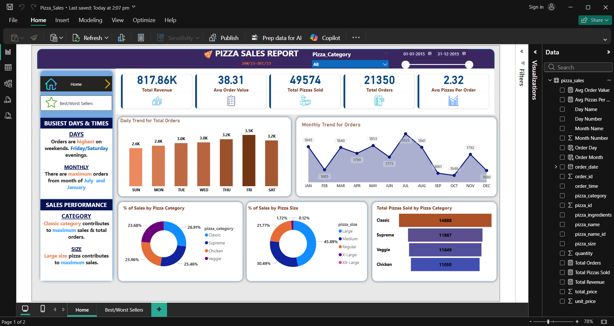
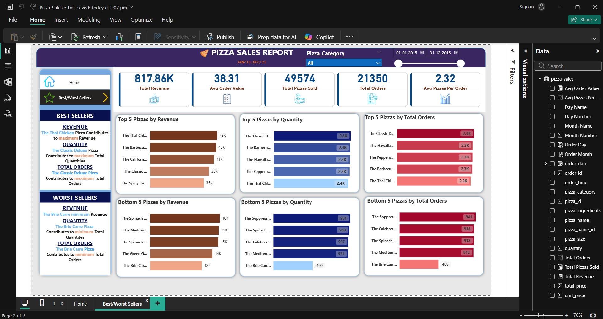

# Pizza Sales Dashboard (SQL + Power BI)

## 📌 Project Overview
Analyzed pizza sales data using SQL Server and built an interactive dashboard in Power BI to visualize key business insights such as revenue, orders, and sales trends.

## 🛠 Tools Used
- SQL Server (Data extraction and analysis)
- Power BI (Dashboard and visualization)

## 📊 Dataset
Sample dataset used for analysis and visualization

## 📊 Dashboard Preview

## 🔍 Key Analysis
- Total revenue and order trends
- Average order value and pizzas per order
- Sales distribution by category and size
- Daily and monthly sales trends
- Top and bottom performing pizzas

## 🔍 SQL Analysis
- Data extraction and transformation using SQL Server
- Aggregations to calculate revenue, orders, and averages
- Identified top-selling and low-performing pizzas
- Analyzed sales trends across categories and sizes

## 📈 Key Insights
- Peak sales occur during specific days and months  
- Large size pizzas contribute the highest revenue  
- Certain categories dominate overall sales  
- Identified top-performing and low-performing products  

## 📂 Files Included
- Pizza_Sales.sql → SQL queries used for analysis  
- Pizza_Sales.pbix → Power BI dashboard
- pizza_sales.csv → Dataset  

## 🚀 Conclusion
This project demonstrates end-to-end data analysis using SQL Server and Power BI, including data querying, transformation, and visualization to derive actionable business insights.
